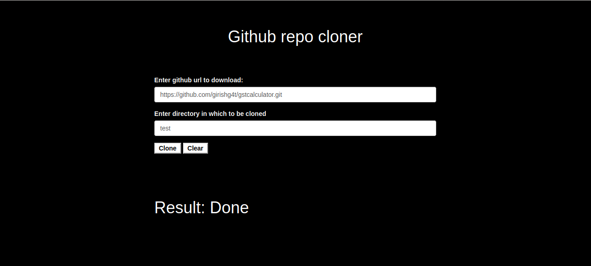

This project is to demonstrate the cloning of git repo inside a container, it uses skaffold templete to create docker file and deploy the application in kubernetes , this application does the following steps

1) Requests Github for Read-access on the repositories 
2) Github asks for user credentials, user enters credentials
3) Github authorizes and gives token to App, 
4) The App clones the repository on behalf of the user. 

You can run the application using 

```skaffold dev```

for more details on skaffold visit https://skaffold.dev/docs/quickstart/



Below are the steps you need to perform
1) To run the application you need to register the application in github and update the .env file with the client_id, client_secret and serverSecret
2) To clone the repo enter the repo url to be cloned and directory in which to be cloned, the given repo will be cloned inside the container by clicking on clone button.  
one's done the Result will be shown as Done in result field.  
you can check the cloned repo by going inside the container

3) To clear the session click on clear button, it will clear the current github session
